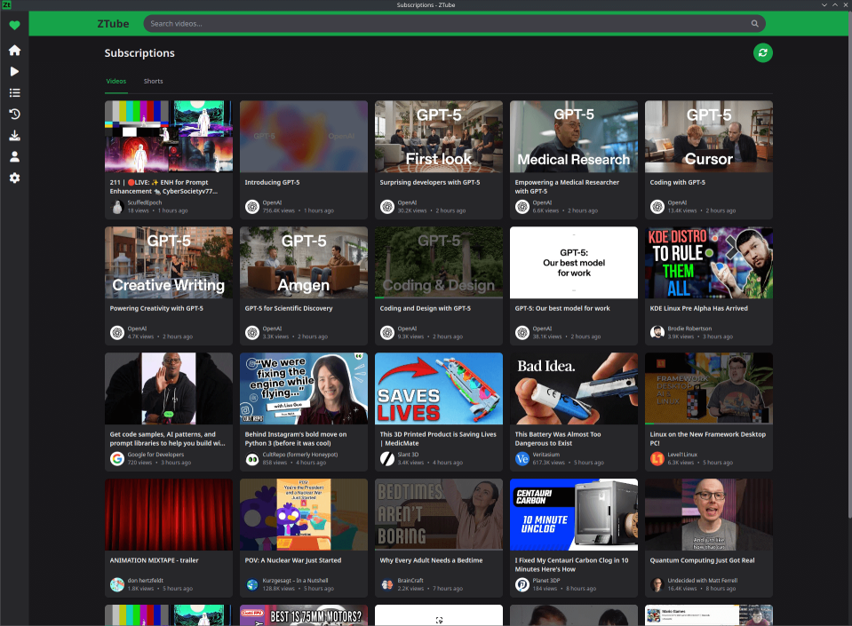

# ZTube

Privacy‑first YouTube client with a clean UI, local storage, and optional desktop app. ZTube uses `youtubei.js`, an Express backend, and an EJS frontend. Data lives locally in SQLite.



### Highlights
- **Subscriptions feed**: Aggregated via channel RSS with thumbnails and view counts; hide Shorts by default or separate them.
- **Search**: Relevance and sorting (newest, oldest, views, duration) with Shorts filtering.
- **Video pages**: Details, chapters (when available), comments, and recommendations.
- **Playlists**: Create, edit, delete, default “Watch Later”, add/remove/reorder videos.
- **Watch history**: Progress tracking, resume, sort, remove entries, or clear all.
- **Shorts**: Dedicated pages for trending and subscription Shorts.
- **Content filters**: Hide channels and keywords globally.
- **Local-first**: SQLite at `~/.config/ztube/ztube.db` (auto‑migrates from project root if present).
- **LibRedirect**: Open `freetube://` links directly in ZTube. See `LIBREDIRECT_SETUP.md`.

### Download

Downloads for Linux (AppImage) and Windows can be found on [the releases page](https://github.com/Zetaphor/ztube/releases).

**Note that the I only test the Linux releases. The Windows builds are completely automated and provided as a courtesy with no guarantee of functionality.**

### Use ZTube
1) Install dependencies (first run)
```bash
npm install
```

2) Start ZTube
```bash
# Web: start the server, then open http://localhost:4420
npm start

# Or Desktop (Electron) in development
npm run electron:dev
```

- **Env**: `PORT` (default `4420`).
- **Data**: SQLite file at `~/.config/ztube/ztube.db`.

- **Import your data**: Use the in‑app Import option to bring in FreeTube subscriptions, watch history, and playlists. No CLI required.

### LibRedirect
Automatically open YouTube links in ZTube using the `freetube://` scheme. See `LIBREDIRECT_SETUP.md` for setup instructions.

### Build
Package the desktop app (Electron):
```bash
npm run build:linux
npm run build:mac
npm run build:win
```

### Develop locally
- Web server with autoreload:
```bash
npm run dev
```

- Desktop app in development mode:
```bash
npm run electron:dev
```

- Configuration:
  - `PORT` env var (default `4420`)
  - Data stored at `~/.config/ztube/ztube.db`
